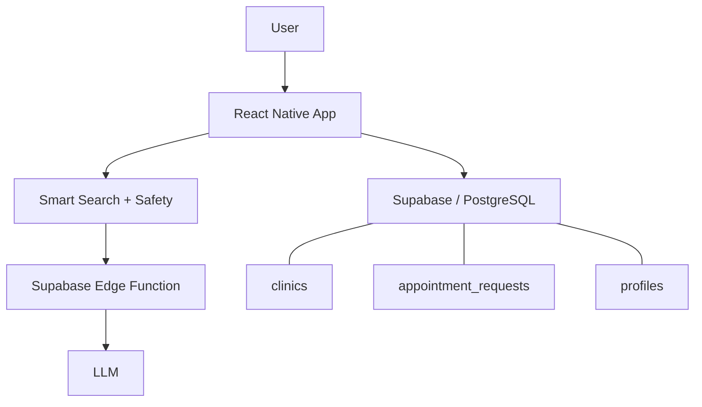

# Meditrina

**AI-assisted healthcare appointment booking MVP**

## What it is

Meditrina is an iOS MVP where a user can describe a health complaint, get directed toward a relevant medical specialty, find clinics, and request an appointment.

**Meditrina does not diagnose, recommend medication, or give medical advice.** The AI is only used to help with routing and booking.

## Why I built it

I built Meditrina as a personal MVP to learn how an AI feature fits into a real mobile product. I wanted practice with React Native / Expo, connecting an LLM to an app through Supabase, setting clear AI safety boundaries, and using AI coding tools without blindly trusting the output.

## How it works

1. User describes a complaint.
2. Smart Search asks follow-up questions if needed.
3. Safety checks handle medical-advice requests and red flags.
4. The app routes the user toward a specialty.
5. User can browse clinics and available appointments.
6. Booking requests are stored through Supabase.

## AI part

Smart Search is powered by an LLM. The app calls a Supabase Edge Function, gets a structured response, and falls back to local behavior if the AI request fails.

- LLM-powered Smart Search
- Supabase Edge Function
- Structured responses
- Fallback if the AI request fails
- AI is used for routing, not diagnosis

## Safety

Because this is healthcare-related, I treated AI limits as an important part of the MVP. The assistant is not allowed to diagnose, suggest treatment, or recommend medication. Medical-advice requests are redirected toward booking help, while red-flag inputs show emergency guidance.

- No diagnosis
- No medication or treatment recommendations
- Red flags show emergency guidance instead of specialty routing

## Tech stack

- Expo / React Native / TypeScript
- NativeWind
- Supabase / PostgreSQL
- Supabase Edge Functions
- LLM API
- Git

## Architecture

## Screenshots

Screenshots use demo / sample data. The Profile screen shows a fictional demo account.

| Splash | Home |
| --- | --- |
|  |  |
| Meditrina branded intro | Home with Smart Search |

| Smart Search | Specialty result |
| --- | --- |
|  |  |
| Follow-up questions | Specialty routing |

| Booking | Clinics |
| --- | --- |
|  |  |
| Appointment selection | Clinic filters |

| Map | Profile |
| --- | --- |
|  |  |
| Clinic map | Profile (demo data) |

## What currently works

- AI Smart Search
- Specialty routing
- Safety / red-flag handling
- 28 demo clinics
- Clinic filters and map
- Appointment requests
- Cancellation sync
- Profile
- Authentication foundation

## What I learned

- Breaking a bigger idea into small MVP phases
- Connecting a mobile frontend to Supabase
- Working with LLM responses safely
- Testing on a real iPhone
- Using AI coding tools while still checking the result myself

## Status

**Private MVP / active development**

This is a learning and product-validation project, not a live healthcare service.

## Next steps

- User-linked appointments
- Clinic/admin tools
- Privacy/legal review
- Production deployment

## Privacy

This public repository contains documentation and demo screenshots only — no application source code, patient data, API keys, or credentials.
