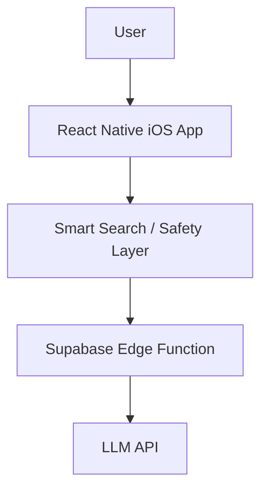
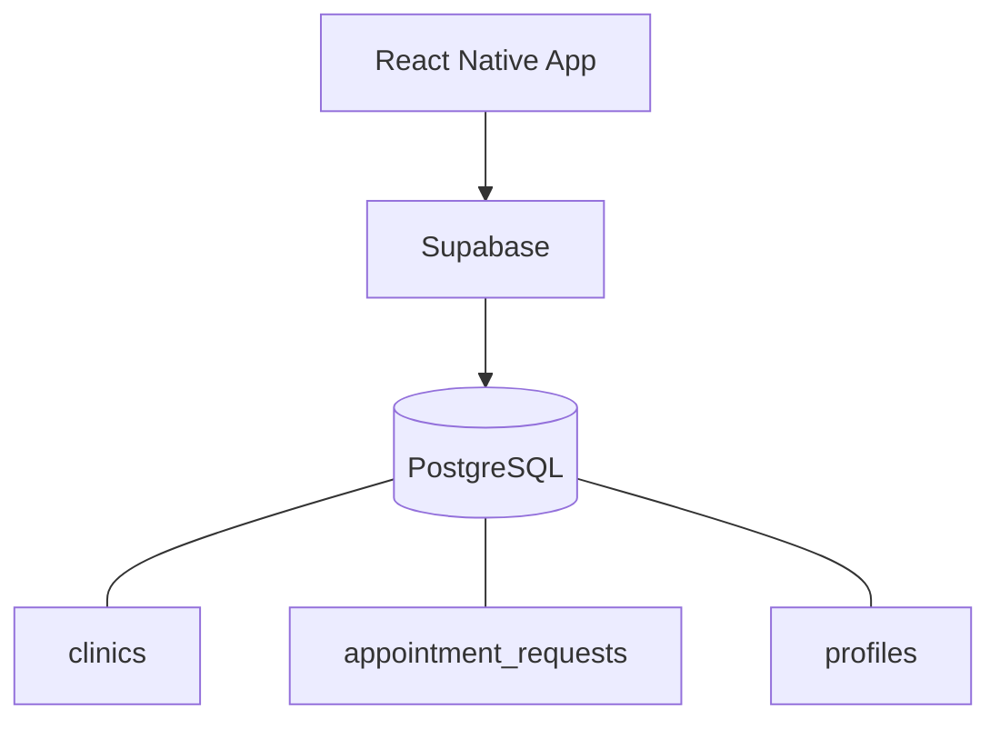
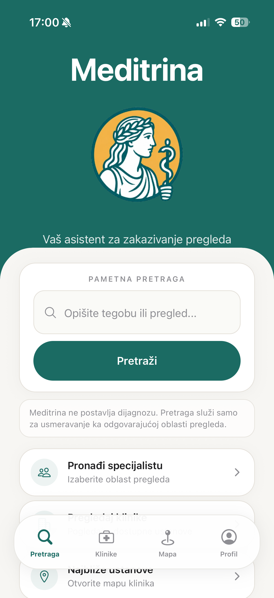
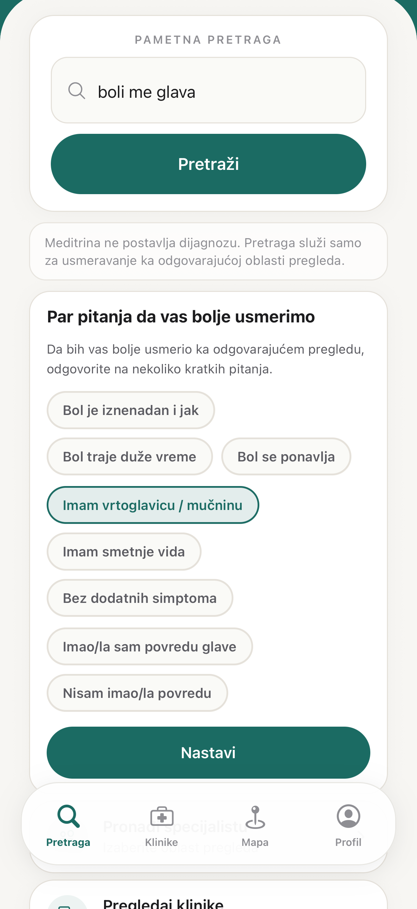
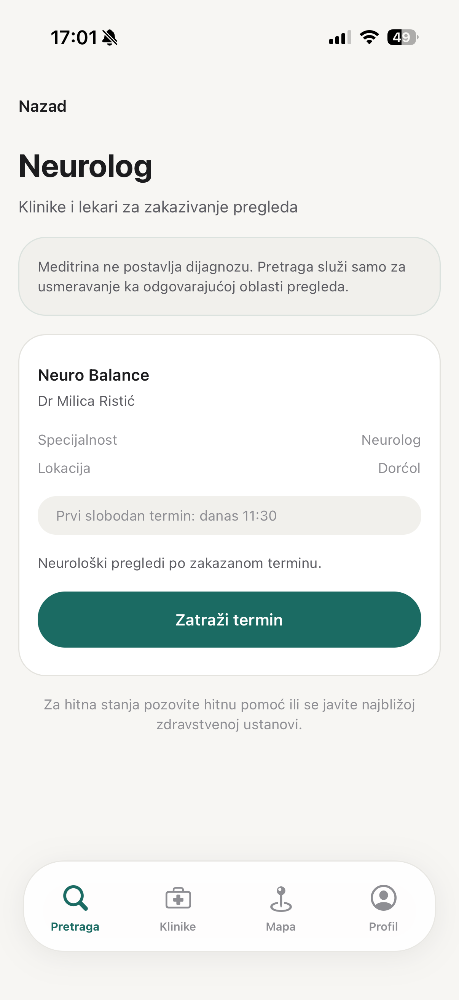
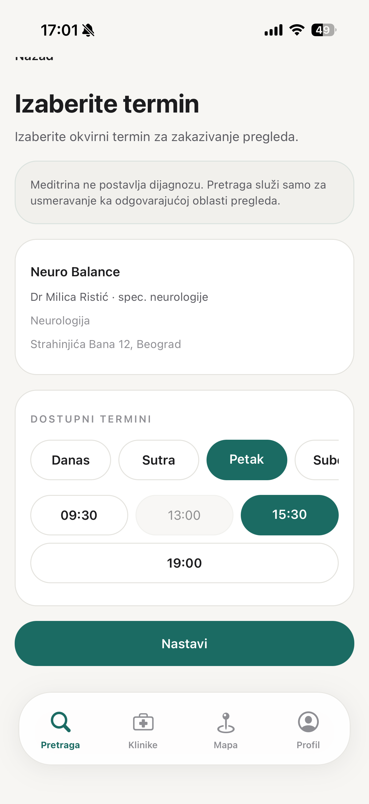
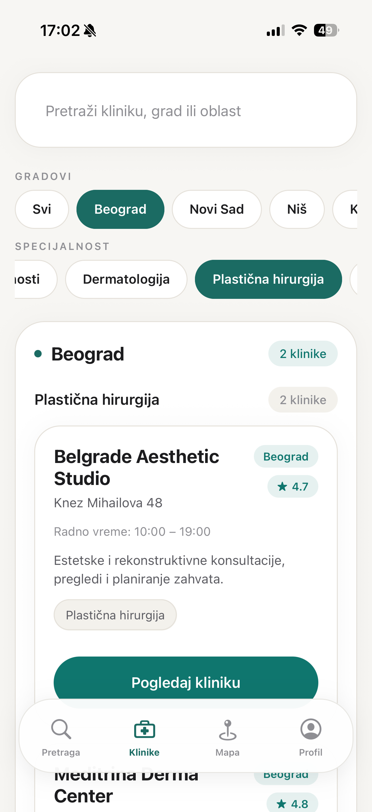
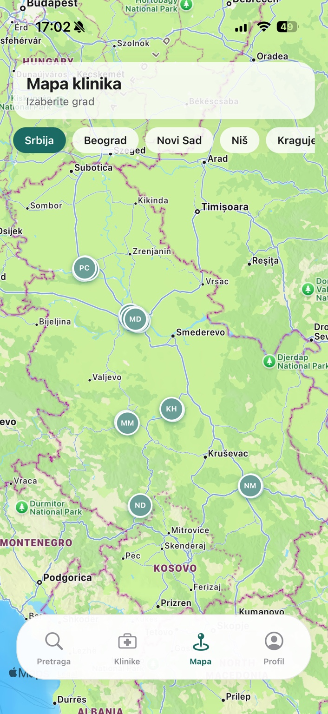
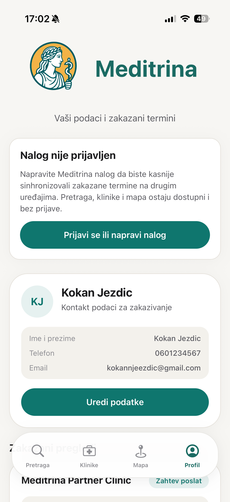

# Meditrina

**AI-assisted healthcare appointment booking MVP**

A mobile-first iOS prototype that helps users describe a health complaint, find an appropriate medical specialty, explore clinics, and request an appointment.

---

## Overview

Meditrina is a mobile-first iOS MVP designed to help users:

1. describe a health complaint;
2. be routed toward an appropriate medical specialty;
3. discover relevant clinics;
4. request an appointment.

**Meditrina does not diagnose medical conditions, recommend medication, recommend treatment, or provide medical advice.**

The AI layer is intentionally constrained to routing and appointment discovery — not clinical decision-making.

---

## Why I Built It

I built Meditrina to learn by shipping a real product end to end.

The project is a hands-on way to practice:

- AI product development
- LLM integration
- mobile UX
- React Native
- Supabase
- backend integration
- safety guardrails
- iterative MVP development
- AI coding-agent workflows
- physical-device QA on iPhone

It is a learning-driven MVP, not a claim of professional software-engineering expertise.

---

## Core User Flow

1. User describes a complaint.
2. Smart Search processes the request.
3. Safety logic checks for medical-advice requests and red flags.
4. The user is routed toward an appropriate specialty.
5. Clinics can be explored by location and specialty.
6. The user selects a clinic and appointment.
7. The request appears in Profile.
8. Cancellation is synchronized with the backend.

---

## AI Smart Search

Smart Search is the core AI-assisted entry point.

At a high level, the current implementation includes:

- an LLM-backed Smart Search path for natural-language complaint input;
- a Supabase Edge Function that mediates the model call;
- structured response handling so the client receives predictable routing fields;
- client-side validation of AI responses before they affect navigation;
- fallback behavior when the AI path is unavailable or returns an invalid result;
- loading and error handling so the user experience remains usable during failures.

The AI output is used for **product routing** (specialty direction and booking discovery), not diagnosis.

System prompts, private endpoint details, and credentials are intentionally excluded from this public package.

---

## AI Safety / Guardrails

Safety boundaries were treated as a core product requirement from the start — not an afterthought.

Meditrina was designed so the AI must **not** provide:

- diagnoses
- medication recommendations
- treatment recommendations
- medical advice

In practice:

- medical-advice requests are intercepted and redirected toward booking help;
- red-flag inputs trigger emergency-oriented guidance instead of specialty shopping;
- AI outputs are constrained toward medical specialty routing and appointment discovery;
- safety checks exist both around the AI interaction and within the application flow.

A large part of the product work was defining what the assistant must **not** do in a healthcare-adjacent context.

---

## Current Functionality

This MVP currently includes:

- Smart Search
- Serbian-language complaint input
- specialty routing
- medical safety guards
- red-flag handling
- clinic discovery
- city filtering
- specialty filtering
- map-based clinic discovery
- 28 demo/sample clinic records across Serbian cities
- clinic details
- appointment request flow
- local Profile appointment state
- Supabase appointment request insert
- cancellation synchronization
- authentication foundation

Meditrina is a product-validation prototype with demo clinic data. It is **not** a live healthcare service and is **not** available on the App Store.

---

## Tech Stack

| Layer | Tools |
| --- | --- |
| Mobile app | Expo, React Native, TypeScript, NativeWind |
| Backend | Supabase, PostgreSQL, Supabase Edge Functions |
| AI | LLM API (via Edge Function) |
| Version control | Git |

---

## Architecture

### AI path

### Data path

No database credentials, project URLs, or API keys are included in this repository.

---

## Screenshots

Screenshots show the MVP UI with **demo / sample data** (including a fictional profile account). Capture guide: [SCREENSHOTS.md](./SCREENSHOTS.md).

---

## Product / Engineering Challenges

### AI boundaries

Preventing a healthcare-oriented assistant from behaving like a doctor. The product needed clear refusal paths for diagnosis, medication, and treatment requests while still helping users book care.

### Data consistency

Keeping clinic data consistent between list and map views so filters, specialties, and locations stay aligned across screens.

### Hybrid booking state

Keeping local UI state synchronized with Supabase appointment requests — including create and cancel flows — without treating the client as the source of truth.

### Async resilience

Avoiding duplicate submissions, stuck loading states, and state updates after unmount during network-bound booking and search operations.

### Mobile-first UX

Building and repeatedly testing the product on a physical iPhone rather than designing it as a web application first.

---

## What I Learned

- Break a product into small phases instead of trying to finish everything at once.
- Define AI constraints before scaling functionality.
- Distinguish UI state from backend state early.
- Validate database behavior rather than assuming inserts and updates work.
- Debug React Native on a real iPhone, not only in simulation.
- Use AI coding agents effectively — and review / QA their output instead of accepting it blindly.
- Create Git checkpoints before major changes so experiments stay reversible.

---

## Development Workflow

Human-in-the-loop process used on this project:

**Product decision / architecture → AI-assisted implementation → code review → TypeScript / Expo validation → physical iPhone QA → Git checkpoint**

AI tools accelerate implementation. Product judgment, review, and device QA remain human-owned.

---

## Project Status

**Private MVP — Active Development**

Meditrina is currently:

- a product-validation prototype;
- an AI/mobile development learning project;
- not yet a publicly deployed healthcare platform.

---

## Next Steps

Potential future work (not completed):

- user-linked appointments
- clinic/admin workflows
- production authentication
- privacy/legal review
- production deployment
- App Store distribution

---

## Privacy

This public repository contains:

- no real patient data;
- no authentication credentials;
- no API keys;
- no production database dump;
- no proprietary application source code.

Screenshots use demo / sample clinic and booking data. Any profile contact fields shown are **fictional demo account data** created for the MVP, not information about a real person.

It is a documentation-only portfolio package describing the private Meditrina MVP.
